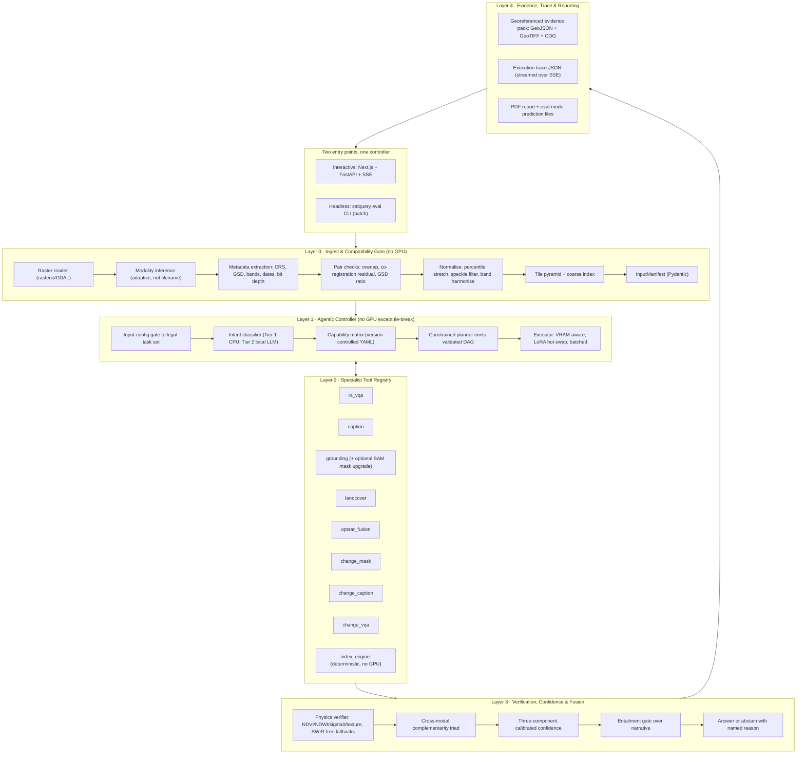

# SatQuery AI — Solution Architecture & System Design

**PS 26167 · ISRO / Department of Space · SIH 2026 · Software · Space Technology**
Document 1 of 6 · Written 2026-08-27 · Supersedes all earlier architecture drafts

> This document is the merged, final architecture. It consolidates five independent design passes and adds the decisions none of them made. Where a claim is unverified, it is marked **[VERIFY]** and appears in the week-0 gate in document `00`.

---

## 0. Design axioms

Everything below follows from six constraints that, taken seriously, force a specific architecture. Most teams will violate axioms 1, 4 and 6 and lose marks they never see.

### Axiom 1 — Training data and evaluation data are ~10–20× apart in ground sample distance

BigEarthNet patches are 120×120 px at 10 m GSD — a 1.2 km tile. The private ISRO/SAC set is **Cartosat-2S** (≈0.65 m PAN, ≈1.6 m MX) paired with **RISAT** SAR (≈0.35–9 m depending on which RISAT and which mode). A model adapted only at Sentinel scale will emit confident nonsense on sub-metre imagery, and object-level grounding collapses entirely — at 10 m GSD an aircraft occupies well under one pixel.

**Consequence:** two adaptation tracks plus an explicit resolution-bridging mechanism (band-presence masking, band dropout, GSD-conditioned scale augmentation, and a 10 m → 5 m → ~1.6 m transfer ladder). Detailed in document `03`.

### Axiom 2 — Cartosat-2S has no SWIR band. Two of the four classical indices are unavailable on the evaluation set.

This is the sharpest practical consequence of the sensor choice and no competing analysis noticed it.

| Index | Bands needed | Cartosat-2S MX (4-band VNIR) | Cartosat-2S PAN (1 band) |
|---|---|---|---|
| NDVI = (NIR−Red)/(NIR+Red) | Red, NIR | ✅ available | ❌ |
| NDWI = (Green−NIR)/(Green+NIR) | Green, NIR | ✅ available | ❌ |
| MNDWI = (Green−SWIR)/(Green+SWIR) | Green, SWIR | ❌ **unavailable** | ❌ |
| NDBI = (SWIR−NIR)/(SWIR+NIR) | SWIR, NIR | ❌ **unavailable** | ❌ |

The representative query *"Use the optical and SAR images together to identify built-up and water-covered regions"* asks for **built-up**, and NDBI is the standard optical built-up index. It will not exist on the evaluation data.

**Consequence:** the built-up detector must be **SAR-primary** (high σ⁰, double-bounce, high local variance) with an optical **texture** channel (GLCM contrast/entropy, local gradient density) as the secondary signal — not NDBI. Build the index engine so every claim has a documented **SWIR-free fallback path**, and log which path was taken in the trace. This also happens to be a genuinely correct remote-sensing argument for *why* the optical–SAR pair is necessary, which is exactly what the PS asks you to demonstrate.

### Axiom 3 — Only the observable execution trace is evaluated

The PS states it outright: internal reasoning is neither required nor evaluated, but the selected task, model/tool names, permitted parameters and outputs are. A free-form "LLM decides what to call" agent is therefore *strictly worse* than a **constrained planner over a version-controlled capability matrix** — identical behaviour when it works, far better auditability, and it is structurally incapable of emitting an illegal plan or an unpermitted parameter. Determinism is a feature here.

### Axiom 4 — The system will be scored in batch, not in a demo

"Final evaluation will use prescribed public benchmark test subsets and an ISRO/SAC evaluation dataset. Scores will be normalised before combining different metrics." That means someone runs your system over thousands of items and computes metrics. An 8-second interactive pipeline with SSE streaming and PDF generation per query is unusable for that.

**Consequence:** build **two entry points from day one** — an interactive server and a **headless batch runner** (`satquery eval --manifest x.jsonl --task vqa --out preds.jsonl`) that shares the same controller but skips report generation, streams nothing, batches GPU calls, and emits predictions in the exact reference format for each of the four annotation types the PS names (answers, labels, bounding boxes, masks). Teams that only build the GUI will scramble to retrofit this in the last week.

### Axiom 5 — Breadth beats depth under normalised score combination

Five mandatory functional areas. A zero in any one costs far more than a leaderboard win in another. Optimisation target: **no gaps first, then depth.** The descope ladder in document `04` is ordered on exactly this principle.

### Axiom 6 — The Grand Finale is 36 hours on-site with unreliable networking

Anything that must reach a hosted API to function is a demo-day liability. The entire system must boot from a local model cache with the network cable unplugged. This is tested routinely, not hoped for.

---

## 1. System overview



Five layers, clean seams. **Layers 0, 1 and 4 are pure software engineering with essentially zero GPU cost** — that is where a full-stack-strong team converts its actual strength directly into marks, and it is precisely where competing teams will be thinnest. Layer 2 is the GPU-bound part, deliberately decomposed into small independently swappable specialists so that one or two people can work on models while four people build against frozen contracts.

---

## 2. Layer 0 — Ingest & Compatibility Gate

The PS names "input upload and compatibility checking" as an explicit deliverable and requires the controller to "check the number, modality, format, metadata, and compatibility of the input images." Most teams will check a file extension and move on. Doing this properly costs no GPU and produces visible, demonstrable operational rigour — the exact quality an ISRO/SAC reviewer is looking for.

### 2.1 Format gating is a compliance requirement, not a nicety

Read the PS clause precisely: *"GeoTIFF or TIFF for geospatial imagery. PNG and JPEG inputs may be accepted only for the prescribed public benchmark datasets."*

So the reader runs in one of two declared modes, and the mode is recorded in the trace:

```python
class IngestMode(str, Enum):
    OPERATIONAL = "operational"   # GeoTIFF/TIFF only; PNG/JPEG rejected with a reason
    BENCHMARK   = "benchmark"     # PNG/JPEG permitted; must name the benchmark
```

In `BENCHMARK` mode the request must carry `benchmark: Literal["VRSBench","RSVQA-LR","RSVQA-HR","CDVQA","LEVIR-CC","LEVIR-CD","DIOR-RSVG"]`, and the trace records it. A PNG submitted in operational mode is rejected with `"PNG accepted only for prescribed public benchmarks; supply GeoTIFF for operational analysis."` That single rejection line demonstrates you read the PS more carefully than anyone else in the room.

### 2.2 Modality inference — adaptive, never from the filename

| Signal | Optical RGB/PAN | Multispectral (S2) | SAR |
|---|---|---|---|
| Band count | 1 (PAN) or 3–4 | 10–13 | 1–2 (VV,VH) or 3–4 (quad-pol) |
| Dtype | uint8 / uint16 (often 10–12 bit packed in 16) | uint16 | float32 σ⁰, or uint16 amplitude |
| Per-band histogram | broadly symmetric | NIR/SWIR present, distinct band stats | heavy right tail, Gamma/Rayleigh-like |
| Local coefficient of variation | low | low | **high** (speckle) |
| Metadata tags | `B,G,R`; `PAN`; `Cartosat` | `B01..B12`; `SENTINEL2` | `VV`,`VH`,`HH`,`HV`,`sigma0`, incidence angle, `RISAT` |

Implement the SAR discriminator as a sliding-window coefficient of variation plus a Gamma goodness-of-fit test — roughly 30 lines of NumPy — and **make the CoV threshold adaptive to look count** rather than hardcoding it. Work in **amplitude**, where single-look speckle gives CoV ≈ 0.52 (Rayleigh: √(4/π − 1)) and an L-look product scales as ≈ 0.52/√L, so a 4-look product sits near 0.26. Note that in **intensity** the single-look figure is 1.0, not 0.52 — so state which domain you are measuring in, because mixing the two is a classic error. A fixed threshold misclassifies multi-look RISAT MRS products as optical. Estimate look count from the histogram shape, or fall back to a two-cluster split on the CoV distribution.

Record modality **with the evidence that produced it** in the trace: `{"modality":"SAR","evidence":{"band_count":2,"pol_tags":["VV","VH"],"local_cov":0.47,"gamma_fit_p":0.31}}`. Reviewers trust an inference they can audit.

### 2.3 Per-image compatibility checks

For every input: readable; CRS present; affine geotransform present; GSD derived from the transform (not from a filename or an assumption); dtype and **effective bit depth** (a uint16 Cartosat product carrying 10-bit or 11-bit data has a real range of 0–1023 or 0–2047, so a fixed /65535 normalisation destroys contrast — always derive scaling from the data or from `NBITS`/`STATISTICS_*` tags); NoData fraction; and, for optical, an estimated cloud fraction from a brightness + NIR/Green heuristic. Do not over-engineer cloud masking; a coarse fraction is enough because its only job is to feed the routing prior and the input-quality confidence term.

### 2.4 Pair compatibility

**Cross-modal pair.** Require exactly one optical/MSI and one SAR. Reproject both to a common CRS. Require footprint intersection ≥ 70 % (configurable, logged). Compute the GSD ratio and resample the coarser onto the finer grid, logging the method. Estimate the co-registration residual.

**Bi-temporal pair.** Require two spatially corresponding images. Parse acquisition dates from `TIFFTAG_DATETIME`, `ACQUISITION_DATE`, or a sidecar XML — and if absent, **ask the user rather than guess**. An abstention here is worth more than a fabricated date. Same modality is preferred; if the modalities differ, flag the result as cross-sensor change and lower the confidence prior.

### 2.5 Co-registration verification — cheap, and it lands with the reviewer

The PS says the ISRO set is *pre*-georeferenced and co-registered, so you will not be graded on fixing it. But *verifying and reporting* it is exactly the operational discipline the organisation cares about, and it costs almost nothing.

- **Same-modality bi-temporal:** `skimage.registration.phase_cross_correlation` gives a sub-pixel shift directly.
- **Optical–SAR:** raw intensities are essentially uncorrelated, so phase correlation on raw pixels fails. Correlate **gradient-magnitude maps** (Sobel, or a Canny-derived structure map) or use **mutual information**. This is a specific, non-obvious detail — getting it right is a visible competence signal.

Report the residual in both pixels and metres. Gate on it: residual > 2 px → either auto-align using the estimated shift (logged as an explicit parameter) or continue with a `WARN` and a reduced input-quality confidence term.

### 2.6 Normalisation and band harmonisation

Optical produces **two distinct products from one read**, and conflating them is a common bug that silently breaks every index:

1. a **float reflectance/DN array** retaining all bands, for the index engine; and
2. a **2–98 percentile-stretched 8-bit RGB**, for the vision encoder.

Cartosat-2S PAN is single-band: either replicate to three channels, or if the MX product is also supplied, pan-sharpen (Brovey or Gram–Schmidt) and log which path was taken.

SAR: calibrate DN → σ⁰ where metadata permits, otherwise apply a robust log stretch; refined-Lee speckle filter at 5×5; clip to roughly [−25, +5] dB for C-band; and build a **pseudo-RGB as `[VV, VH, VV/VH]`** so an RGB-pretrained encoder has structured input. For quad-pol RISAT products a **Pauli decomposition** RGB is a better visualisation and a better encoder input than raw amplitude — worth implementing because RISAT-1 supports circular/hybrid polarimetry and RISAT-2B-series products may be quad-pol. **[VERIFY]** which RISAT and which mode ISRO/SAC will use; design for both C-band (RISAT-1, ~3–50 m) and X-band (RISAT-2B/2BR1, ~0.35–4 m).

> **Do not hardcode absolute σ⁰ thresholds.** Water at C-band and water at X-band sit at different backscatter levels, and calibration state varies by product. Use **adaptive thresholding** — Otsu or a bimodal Gaussian-mixture split on the σ⁰ histogram, with the absolute dB value used only as a sanity bound and as a prior. Log the chosen threshold as a parameter. This single decision is the difference between a verifier that works on RISAT and one that silently fails on it.

**Band harmonisation** is the mechanism that bridges Sentinel-2's 12 bands to Cartosat-2S MX's 4. Map every input onto a canonical band vocabulary — `{Blue, Green, Red, RedEdge, NIR, SWIR1, SWIR2, PAN, VV, VH, HH, HV}` — carrying a **presence mask**, and condition the encoder on band identity (wavelength-conditioned embeddings à la DOFA, or learned per-band tokens with missing bands masked out). Train with **random band dropout** so the encoder never assumes a fixed band set. This is what lets a BigEarthNet-adapted encoder generalise to a sensor it has never seen instead of collapsing.

### 2.7 Large-scene handling: tile pyramid and coarse-to-fine retrieval

A Cartosat-2S scene is far larger than any VLM's input window, and squashing 4096×4096 into 336×336 destroys exactly the object detail the high-resolution tasks depend on. This was the largest gap in earlier drafts.

```
Full scene (GeoTIFF, possibly 10k x 10k)
   ↓  build COG + overview pyramid  (rio-cogeo)
   ↓
Level 0: whole-scene downsample  →  scene-level caption / land-cover / VQA-global
   ↓
Level 1: 512x512 tiles with 64 px overlap  →  cheap embedding per tile (index_engine stats + encoder CLS)
   ↓
Coarse index (in-memory FAISS or plain cosine over a few hundred vectors)
   ↓
Query-conditioned tile retrieval: top-k tiles by text-embedding similarity + index-engine prior
   ↓
Level 2: full-resolution inference (grounding / VQA / fusion) on retrieved tiles only
   ↓
Merge: NMS across tile boundaries, pixel to CRS coordinate transform, stitched mask
```

Two consequences worth stating on a slide. First, this bounds inference cost independent of scene size — an important, checkable engineering claim. Second, **retrieval is itself an auditable planner step**: the trace records which tiles were retrieved and why, which strengthens the orchestration story rather than complicating it.

For scenes small enough to process whole (all public benchmark images are), the pyramid path is bypassed and the trace records `tiling: "bypassed (scene fits in one window)"`.

### 2.8 Output contract

```python
class ImageMeta(BaseModel):
    role: Literal["single","optical","sar","t1","t2"]
    path: Path
    modality: Literal["OPTICAL","MSI","PAN","SAR"]
    modality_evidence: dict
    crs: str
    gsd_m: float
    width: int; height: int
    bands: list[str]              # canonical band names, "UNKNOWN_n" if unmapped
    band_presence: list[bool]     # against the canonical vocabulary
    dtype: str
    effective_bits: int
    acquisition_dt: datetime | None
    nodata_pct: float
    cloud_pct: float | None
    sensor_guess: str | None
    polarisations: list[str] | None
    look_count_est: float | None

class CheckResult(BaseModel):
    name: str
    status: Literal["PASS","WARN","FAIL"]
    value: float | str | None
    threshold: float | str | None
    message: str

class CoregReport(BaseModel):
    method: Literal["phase_correlation","gradient_phase_correlation","mutual_information"]
    shift_px: tuple[float,float]
    shift_m: tuple[float,float]
    residual_px: float
    applied_correction: bool

class InputManifest(BaseModel):
    run_id: str
    ingest_mode: IngestMode
    benchmark: str | None
    images: list[ImageMeta]
    config: Literal["SINGLE","CROSSMODAL_PAIR","BITEMPORAL_PAIR"]   # derived, never user-declared
    checks: list[CheckResult]
    coreg: CoregReport | None
    tiling: TilingReport | None
    artifacts: dict[str, Path]     # cog, stretched_rgb, sar_pseudo_rgb, index rasters
    blocking_failures: list[str]
    index_availability: dict[str, bool]   # {"NDVI":True,"NDWI":True,"MNDWI":False,"NDBI":False}
```

Two fields carry disproportionate weight. **`config` is derived, not declared** — it is the primary routing input, and deriving it is what makes the orchestration genuinely automatic rather than a dropdown the user filled in. **`index_availability`** is what lets Layer 3 pick SWIR-free verification paths automatically per Axiom 2, and lets the abstention message name the missing band.

---

## 3. Layer 1 — Agentic controller

Fully specified in **document `02`**. Summary of the design commitment: a closed nine-task taxonomy; routing that uses the derived input configuration to eliminate most of the task space *before* the query is read; a two-tier intent classifier (CPU TF-IDF/transformer first, local constrained-JSON LLM only on low margin); a version-controlled **capability matrix** that defines, per task, the legal tools and the permitted parameters with their ranges; a planner that emits a validated DAG and *cannot* express an illegal step; and an executor with VRAM-aware lazy loading, LoRA hot-swapping and batching.

---

## 4. Layer 2 — Specialist tool registry

Nine tools. The PS explicitly permits multiple specialised components, so lean into specialists rather than forcing one model to do everything badly.

| Tool | Job | Basis (see doc `03` for fallbacks) | Shares weights with |
|---|---|---|---|
| `rs_vqa_v1` | Single-image VQA — **PS-mandatory** | ≤4B VLM, QLoRA on RS instruction mix | `caption_v1` |
| `caption_v1` | Scene description / land-cover narrative | same backbone, caption adapter | `rs_vqa_v1` |
| `grounding_v1` | Text → bbox, optional mask upgrade | Florence-2 fine-tuned on DIOR-RSVG + VRSBench referring | — |
| `landcover_v1` | Multi-label + segmentation | band-agnostic RS encoder adapted on BigEarthNet — **carries the adaptation mandate** | `optsar_fusion_v1` |
| `optsar_fusion_v1` | Joint optical+SAR extraction — **PS-mandatory** | same encoder, dual-stream + cross-attention | `landcover_v1` |
| `change_mask_v1` | Binary / semantic change mask | Change-Agent MCI, or TinyCD/ChangeFormer-b0 | `change_caption_v1` |
| `change_caption_v1` | Change description — **one of two PS-mandatory** | Change-Agent MCI, or RSICCformer on LEVIR-CC | `change_mask_v1` |
| `change_vqa_v1` | Change QA — **one of two PS-mandatory** | classification head on CDVQA, mask-conditioned | — |
| `index_engine_v1` | Deterministic RS indices & statistics | pure NumPy — **no training, never hallucinates** | — |

Note the deliberate weight sharing: `rs_vqa` + `caption` share one backbone and swap LoRA adapters; `landcover` + `optsar_fusion` share one encoder; `change_mask` + `change_caption` share one multi-task change model. That is **four trainings, not nine** — decisive under a free-tier compute budget.

`index_engine_v1` deserves its status as a first-class tool rather than a fallback. It needs no GPU, no training, and cannot hallucinate. It makes the representative query *"Use the optical and SAR images together to identify built-up and water-covered regions"* answerable **deterministically**, with learned models layered on top for the fuzzy parts. Treat it as the ground truth against which the neural tools are checked — that inversion is the core of Layer 3.

### 4.1 Uniform tool interface

Every tool implements one protocol. This is the contract that lets four non-ML members build the entire application against stubs for three months.

```python
class Artifact(BaseModel):
    key: str
    kind: Literal["geojson","geotiff","cog","png","json"]
    path: Path
    crs: str | None
    description: str | None = None

class ToolResult(BaseModel):
    tool: str
    version: str
    payload: dict                 # STRUCTURED FACTS ONLY - never free prose
    artifacts: list[Artifact]
    confidence: float             # [0,1]; see confidence_method for what it IS
    # What the number actually measures. Only `logprob` and
    # `mean_asserted_probability` are probabilities at all, and neither is
    # P(correct) - so none of these is calibratable today. See
    # CALIBRATABLE_CONFIDENCE_METHODS in satquery/controller/calibration.py.
    confidence_method: Literal["logprob","sharpness","mean_asserted_probability","threshold_rule","deterministic"]
    model_card: str               # name, weights sha256, training data summary
    runtime_ms: int
    warnings: list[str]

class Tool(Protocol):
    name: str
    version: str
    permitted_params: type[BaseModel]
    vram_mb: int
    def preflight(self, manifest: InputManifest) -> list[CheckResult]: ...
    def run(self, inputs: dict, params: BaseModel) -> ToolResult: ...
    def run_batch(self, inputs: list[dict], params: BaseModel) -> list[ToolResult]: ...
```

`payload` holding **structured facts rather than prose** is the single most important design decision in the tool layer. Prose is generated exactly once, at the end, by the synthesiser, from structured facts. That is what makes the entailment gate possible, what makes the deterministic quantitative path possible, and what makes `run_batch` usable for the eval runner.

`run_batch` existing from day one is what satisfies Axiom 4. Retrofitting batching into nine tools in the final week is a predictable, avoidable disaster.

---

## 5. Layer 3 — Verification, confidence and fusion

This layer is where the submission separates itself. Most teams will pipe a VLM's output straight to the UI with an invented confidence number.

### 5.1 Physics-in-the-loop verifier, with SWIR-free fallbacks

Classical remote sensing already has reliable, interpretable detectors for exactly the land-cover categories the representative queries name. Encode them as an independent checker on the neural tools.

| Claim | Optical test (full MSI) | Optical test (**4-band VNIR — the ISRO case**) | SAR test |
|---|---|---|---|
| Water | MNDWI > 0.2 (preferred) | **NDWI > 0.2** + low local variance | adaptive-threshold low σ⁰ (specular), very low local CoV |
| Vegetation | NDVI > 0.3 | NDVI > 0.3 | moderate σ⁰, high VH/VV (volume scattering) |
| **Built-up** | NDBI > 0 | **NDBI unavailable** → GLCM contrast/entropy + local gradient density + edge regularity | **primary signal**: high σ⁰, double-bounce brightness, high local variance |
| Bare soil | low NDVI, high brightness | low NDVI, high brightness | moderate σ⁰, low VH/VV |

When `rs_vqa_v1` asserts "there is a water body in the north-east", the verifier computes the available tests over that region and returns a per-claim agreement score. Agreement raises confidence; disagreement lowers it **and is surfaced to the user as a named conflict** rather than averaged away.

The disagreement cases are themselves informative and should be reported as findings:

- optical says vegetation, SAR says smooth and low-backscatter → likely **cloud or shadow** contaminating the optical band;
- optical says water (low NIR), SAR says high σ⁰ with high variance → likely **shadow, dark asphalt, or a burnt scar**, not water;
- optical is saturated/hazy, SAR is structured → route to SAR-dominant and say so.

This is exactly how an operational analyst works, and framing it that way is what lands with an ISRO/SAC reviewer.

### 5.2 Cross-modal complementarity triad — direct evidence for a PS-mandatory claim

The PS requires the system to "extract **complementary** information from a co-registered optical/multispectral and SAR image pair." A good fused number does not demonstrate complementarity. A **triad** does.

For every cross-modal query, run three passes and report all three:

```
A. optical-only   →  prediction_A, confidence_A
B. SAR-only       →  prediction_B, confidence_B
C. fused          →  prediction_C, confidence_C
```

Then compute a **complementarity score** — a per-query number, not just an offline ablation row:

```
gain      = metric(C) − max(metric(A), metric(B))
agreement = IoU(mask_A, mask_B)                 # low agreement ⇒ modalities disagree ⇒ fusion mattered
attribution = per-class, which modality drove the fused decision
```

Reported in the UI as *"SAR contributed +14 % IoU on built-up; optical contributed +9 % on water; the pair agreed on 71 % of pixels."* This is simultaneously (a) a runtime feature, (b) the ablation the evaluators want, and (c) the most convincing 20 seconds of the live demo. Cost: three forward passes of a small encoder instead of one.

### 5.3 Confidence estimation — three components, reported separately

A single opaque number is worthless. Compute and **display** three:

**Model confidence.** For generative answers, mean token log-probability over the **answer span only** (prompt tokens dilute it badly — a common mistake). For classification and segmentation heads, softmax probability after **temperature scaling** fitted on a held-out validation split. Report **ECE before and after** scaling; a reliability diagram with the ECE improvement is a very strong slide and almost no team will produce one.

**Agreement confidence.** Verifier agreement from §5.1, the complementarity triad's internal consistency from §5.2, and optionally **self-consistency** — run the query through three paraphrases and measure answer stability. Cheap, and it is what catches the brittle cases.

**Input-quality confidence.** A prior derived from the Layer 0 manifest: co-registration residual, footprint overlap, cloud fraction, GSD mismatch against the tool's training scale, and **missing bands relative to what the tool was trained on** (this is where Axiom 2 becomes a number).

Combine as a weighted geometric mean with weights fitted on validation, map to High/Medium/Low bands, and **always show the breakdown**. A judge who can see *why* confidence is 0.62 trusts the system far more than one shown a bare 0.62.

### 5.4 Abstention, measured properly

Below threshold, return "insufficient evidence" with the **specific reason** and the **specific additional input that would resolve it**. For example: *"SWIR bands absent from this 4-band product; optical built-up discrimination is unreliable. Answer derived from SAR backscatter alone, confidence 0.54. Supply an MSI product with SWIR, or accept the SAR-only classification."*

Measure this with a **risk–coverage curve and AURC** on the benchmark test splits — accuracy on the answered subset against fraction answered. For an operational space agency, a system that knows its own limits is more valuable than one that always answers, and this plot is the proof rather than the claim.

### 5.5 Synthesis: deterministic path first, gated generation second

Final prose is generated once, from `ToolResult.payload` objects only, never from raw image features.

**Deterministic template path** for every quantitative answer — counts, areas, increase/decrease/unchanged. Note that the representative query *"Has the built-up area increased, decreased, or remained unchanged?"* is a **three-way classification over a computed area difference**. Answer it from the change mask plus a georeferenced area computation plus a significance threshold, via a template. A template is strictly safer than generation here and will be near-perfectly reliable. Do not let a VLM guess at arithmetic it can get wrong.

**LLM narrative path** for open-ended description, then **gated**: split the draft into sentences and check each for entailment against the structured evidence using a small NLI model (~150 MB, CPU-fine). Unsupported sentences are dropped or flagged, and the gate's decisions enter the trace as `{"sentences":6,"retained":6,"flagged":0}`. This is a concrete, *measurable* anti-hallucination mechanism rather than an assertion.

### 5.6 Evidence pack — georeferenced, not screenshots

Every answer ships:

- bounding boxes as **GeoJSON in the source CRS** (plus pixel coordinates);
- masks as **single-band GeoTIFF** preserving CRS and transform;
- index rasters (NDVI, NDWI, σ⁰, texture) as **COGs**;
- overlay PNGs for quick viewing;
- `evidence.json` linking **each textual claim to the artifact that supports it**;
- areas in **m² and hectares**, derived from the affine transform — never pixel counts alone;
- centroid **latitude/longitude** for every reported region.

Bundled as a downloadable ZIP plus a PDF report. The closing move of the demo is opening the GeoTIFF mask in QGIS — output an actual analyst can ingest, not a picture of one.

---

## 6. Layer 4 — Audit trace and reporting

The PS requires "an auditable execution summary containing the selected task, model/tool names, and key parameters." It is directly evaluated and costs no GPU, so over-deliver.

```json
{
  "run_id": "8f2c1a...",
  "timestamp_utc": "2026-11-14T09:21:04Z",
  "code_version": "git:4b91e2c",
  "query": "Use the optical and SAR images together to identify built-up and water-covered regions.",
  "ingest": {
    "mode": "operational",
    "config": "CROSSMODAL_PAIR",
    "images": [
      {"role":"optical","modality":"MSI","bands":["Blue","Green","Red","NIR"],"gsd_m":1.6,
       "effective_bits":11,"crs":"EPSG:32643","cloud_pct":3.1,"sensor_guess":"Cartosat-2S MX",
       "modality_evidence":{"band_count":4,"local_cov":0.07}},
      {"role":"sar","modality":"SAR","polarisations":["HH","HV"],"gsd_m":2.5,"crs":"EPSG:32643",
       "sensor_guess":"RISAT-2B","look_count_est":3.8,
       "modality_evidence":{"local_cov":0.29,"gamma_fit_p":0.41}}
    ],
    "index_availability": {"NDVI":true,"NDWI":true,"MNDWI":false,"NDBI":false},
    "checks":[
      {"name":"format_gate","status":"PASS","value":"GeoTIFF","message":"operational mode satisfied"},
      {"name":"footprint_overlap","status":"PASS","value":0.94,"threshold":0.70},
      {"name":"coreg_residual_px","status":"PASS","value":0.8,"threshold":2.0,
       "message":"method=gradient_phase_correlation"},
      {"name":"gsd_ratio","status":"WARN","value":1.56,"message":"SAR resampled 2.5m -> 1.6m (bilinear)"},
      {"name":"swir_available","status":"WARN","value":false,
       "message":"NDBI unavailable; built-up verification uses SAR sigma0 + optical texture"}
    ],
    "tiling": {"applied": true, "level1_tiles": 64, "retrieved_tiles": 7, "retrieval_reason": "query_terms=[built-up,water]"}
  },
  "routing": {
    "legal_tasks": ["XMODAL_JOINT_EXTRACT","SINGLE_VQA","SINGLE_GROUND","SINGLE_LANDCOVER"],
    "selected_task": "XMODAL_JOINT_EXTRACT",
    "classifier": {"name":"intent-tfidf-lr-v3","top1":0.91,"margin":0.44},
    "llm_tiebreak_invoked": false,
    "capability_matrix_version": "cm-2026.11.02"
  },
  "execution": [
    {"step":"s1","tool":"index_engine_v1","version":"1.0.2",
     "params":{"indices":["NDVI","NDWI","GLCM_contrast"],"sar_threshold_method":"otsu"},
     "outputs":{"ndwi":"art/ndwi.tif","texture":"art/glcm.tif","sar_water_thresh_db":-17.4},
     "confidence":1.0,"confidence_method":"deterministic","runtime_ms":410},
    {"step":"s2","tool":"optsar_fusion_v1","version":"0.9.1",
     "params":{"fusion_mode":"cross_attn","target_gsd_m":1.6,"classes":["built_up","water"],"mode":"triad"},
     "outputs":{"mask_optical":"art/lc_opt.tif","mask_sar":"art/lc_sar.tif","mask_fused":"art/lc_fused.tif"},
     "confidence":0.78,"confidence_method":"mean_asserted_probability","runtime_ms":2140},
    {"step":"s3","tool":"rs_vqa_v1","version":"0.8.0",
     "params":{"max_new_tokens":128,"adapter":"caption_lora_v4"},
     "confidence":0.71,"confidence_method":"logprob","runtime_ms":1890}
  ],
  "verification": {
    "physics_agreement": {"water":0.93,"built_up":0.74},
    "built_up_path": "sar_primary_texture_secondary (NDBI unavailable)",
    "complementarity": {"gain_iou":{"built_up":0.14,"water":0.09},"modality_agreement_iou":0.71},
    "conflicts": [],
    "entailment_gate": {"sentences":6,"retained":6,"flagged":0}
  },
  "confidence": {"final":0.79,"band":"HIGH",
    "components":{"model":0.75,"agreement":0.86,"input_quality":0.81},
    "calibration":{"method":"temperature_scaling","T":1.34,"ece_after":0.041}},
  "answer": "...",
  "artifacts": ["art/lc_fused.tif","art/water.geojson","art/builtup.geojson","art/overlay.png","report.pdf"],
  "abstained": false,
  "weights_hashes": {"optsar_fusion_v1":"sha256:...","rs_vqa_v1":"sha256:..."}
}
```

**Stream this to the UI over SSE as it happens.** A live trace panel filling in step by step is the single most persuasive artefact you can put in front of a judge, because it demonstrates the orchestration is real rather than a diagram on a slide. Use SSE, not WebSockets — one-directional, reconnects cleanly, simpler.

---

## 7. Dual-mode operation

One controller, two entry points. This is a structural requirement (Axiom 4), not an optimisation.

| | Interactive mode | Headless eval mode |
|---|---|---|
| Entry | `POST /api/v1/analyze` + `GET /api/v1/trace/{run_id}` (SSE) | `satquery eval --manifest m.jsonl --task vqa --out preds.jsonl` |
| Ingest | full gate, all checks | full gate, `BENCHMARK` mode, PNG/JPEG allowed |
| Tiling | coarse-to-fine on large scenes | bypassed for benchmark-sized images |
| Verification | full physics + entailment + triad | configurable; `--fast` skips entailment and self-consistency |
| Batching | 1 | `--batch-size N`, uses `Tool.run_batch` |
| Output | answer + evidence pack + PDF + SSE trace | prediction JSONL in reference schema + one summary trace |
| Reports | yes | no |

The eval-mode output schema must cover the four annotation types the PS names:

```jsonl
{"id":"...","task":"vqa","answer":"yes"}
{"id":"...","task":"caption","caption":"..."}
{"id":"...","task":"grounding","boxes":[[412,88,509,171]],"labels":["water body"],"scores":[0.93]}
{"id":"...","task":"change_vqa","answer":"increased"}
{"id":"...","task":"change_map","mask_path":"masks/xxx.tif"}
{"id":"...","task":"landcover","labels":["built_up","water"],"mask_path":"masks/xxx.tif"}
```

Build a `--dry-run` that validates a manifest and emits the schema without running models. When the ISRO harness arrives, format compliance is already proven.

---

## 8. Tech stack

### Backend

Python 3.11. **FastAPI + Uvicorn** for the API. **Pydantic v2** as the backbone of the entire tool-contract and permitted-parameter system — the validation guarantees the PS demands come free from schemas rather than hand-written checks, which is both less code and a better story.

**Orchestration: hand-rolled DAG executor, roughly 300 lines.** LangGraph is a legitimate choice and three of the five reviewed designs reach for it, but here it is the weaker option: the plan is already an explicitly validated DAG, the trace format is custom, the capability matrix already provides the constraint layer LangGraph's conditional edges would duplicate, and you would be debugging someone else's state abstraction at 2 a.m. on finale night. If you do use LangGraph, use it purely as an executor and keep the capability matrix authoritative. **Decide once, in week 0, and do not migrate.**

Geospatial: **rasterio** + **GDAL** (I/O), **rioxarray/xarray** (multi-band arrays), **pyproj** (CRS), **shapely** + **geopandas** (footprints, GeoJSON), **rio-cogeo** (COG + overviews), **scikit-image** (co-registration, morphology, GLCM), **OpenCV** (fast resampling). Deliberately **skip ESA SNAP/snappy** — the JVM bridge is heavy and fragile, and unnecessary when inputs are already calibrated and georeferenced, which the ISRO set will be.

ML: **PyTorch 2.x**, **transformers**, **peft** (LoRA/QLoRA), **bitsandbytes** (4-bit weights, 8-bit optimisers), **accelerate**, **timm**, **torchgeo** (ships BigEarthNet and SEN12MS dataloaders plus pretrained RS weights — saves days of plumbing), **TerraTorch** if you take the Prithvi/TerraMind route.

Jobs and streaming: FastAPI `BackgroundTasks` plus an in-process queue is sufficient at demo scale. Add Redis + RQ only if you genuinely need multiple workers. **SSE** for the trace.

Reports: **WeasyPrint** (HTML → PDF; easiest path since the templates already exist as HTML) with Matplotlib for embedded figures.

Storage: **SQLite** for runs and traces; Postgres + PostGIS only if you actually need spatial queries — you probably do not. Rasters on local disk as COGs keyed by `run_id`.

### Frontend

**Next.js 14 (App Router) + TypeScript + Tailwind + shadcn/ui.** Matches the team's existing strength and produces a credible UI without design work.

**OpenLayers over Leaflet** for imagery. This is a considered choice: OpenLayers has first-class COG/GeoTIFF source support and proper arbitrary-CRS handling, which matters because your inputs are UTM GeoTIFFs, not Web Mercator tiles. Leaflet plus `georaster-layer-for-leaflet` works but you will fight it on projections and lose a day.

Four view components carry the demo:

1. **Bi-temporal swipe comparator** plus a synchronised side-by-side mode.
2. **Optical–SAR opacity blend** with a modality toggle and the fused mask overlay.
3. **Live SSE trace panel** rendering each step as it arrives with tool, version, params, latency and confidence.
4. **Confidence card** showing the three-component breakdown, the calibration temperature, and the abstention reason when present.

Every claim in the answer text is a hover-linked chip that highlights its supporting artifact on the map. That link between prose and evidence is the visual expression of the entailment gate.

Two additional pages, both cheap and both strong demo surfaces: a **Model Registry page** listing every tool with version, weights hash, training data and status; and a **Benchmark page** showing live evaluation numbers from the harness output. The registry page in particular makes "agentic orchestration over a predefined registry" concrete rather than asserted.

### Packaging and deployment

Docker Compose with ~~three services (`api`, `worker`, `web`)~~ **two services (`api`, `web`) — corrected 2026-08-30**: the `worker` was never wired to a queue and was removed rather than implemented, which is what the *Jobs and streaming* note above already argued for. See `docs/adr/002-no-async-worker.md` and a **pre-baked model volume**. Write `scripts/fetch_models.py` to download and **hash-verify** every checkpoint into `./models`, commit the manifest, and run routinely with `HF_HUB_OFFLINE=1 TRANSFORMERS_OFFLINE=1`. On demo day the system must come up with the network cable unplugged.

Two runtime profiles selected by environment variable: **`full`** (real checkpoints on GPU) and **`lite`** (smallest viable models, CPU-tolerable, degraded but never failing). Test `lite` genuinely, not nominally. When the demo laptop's GPU misbehaves at 2 a.m., `lite` is what saves the submission.

Testing: pytest, plus **golden-file tests over the trace JSON** for ~30 curated cases spanning all nine tasks. When someone changes the planner, a diff in the golden trace surfaces it immediately. This is the cheapest available insurance against a last-week regression, and it doubles as evidence of engineering discipline.

---

## 9. Repository structure

```
satquery-ai/
├── README.md                       # incl. requirement traceability matrix
├── docker-compose.yml
├── Makefile                        # make dev / make eval / make offline-test / make demo
├── scripts/
│   ├── fetch_models.py             # download + sha256 verify into ./models
│   ├── fetch_datasets.py           # download + mirror every dataset
│   └── make_demo_bundle.py         # stage the 8 curated demo inputs
├── configs/
│   ├── capability_matrix.yaml       # VERSION CONTROLLED — the auditable artifact
│   │   # tools.yaml was created empty and never read; removed 2026-08-30.
│   │   # The registry is satquery/tools/stubs.py REGISTRY, the permitted
│   │   # parameters are configs/capability_matrix.yaml, the VRAM budgets are
│   │   # router.TOOL_VRAM_MB, and the weights hashes are computed at load
│   │   # time by satquery/tools/provenance.py.
│   ├── thresholds.yaml              # overlap, coreg, abstention, index thresholds
│   └── profiles/{full.yaml,lite.yaml}
├── satquery/
│   ├── contracts/                  # Pydantic: InputManifest, Plan, ToolResult, Trace
│   ├── ingest/                     # reader, modality, checks, coreg, normalise, harmonise, tiling
│   ├── controller/                 # intent, matrix loader, planner, executor, vram_manager
│   ├── tools/                      # one module per tool + base.py + stubs.py
│   ├── verify/                      # index_engine, physics, complementarity, calibration, entailment
│   ├── synth/                       # templates.py, narrative.py
│   ├── trace/                       # writer, sse, golden
│   ├── report/                      # weasyprint templates, evidence_pack.py
│   ├── api/                         # FastAPI routes
│   └── cli/                         # satquery eval | serve | dryrun | bench
├── training/
│   ├── prepare/{bigearthnet.py,vrsbench.py,rsvqa.py,cdvqa.py,levir.py,whu_opt_sar.py}
│   ├── track_a_encoder.py          # band-agnostic encoder on BigEarthNet
│   ├── track_b_vlm_qlora.py        # VLM instruction tuning
│   ├── train_change_mask.py
│   ├── train_change_vqa.py
│   ├── train_grounding.py
│   └── configs/*.yaml
├── evaluation/
│   ├── harness.py                  # one command, one JSON report
│   ├── metrics/                    # vqa, caption, grounding, segmentation, calibration, aurc
│   ├── ablations.py                # two-track, triad, agent-vs-monolith, verifier on/off
│   └── splits/                     # geographic block splits, manifests
├── frontend/                       # Next.js app
├── tests/
│   ├── golden_traces/              # ~30 cases, all nine tasks
│   └── test_*.py
├── models/                         # gitignored, populated by fetch_models.py
└── data/                           # gitignored
```

---

## 10. Non-functional requirements

| Property | Target | How it is achieved | How it is proven |
|---|---|---|---|
| Offline operation | boots with no network | prefetched hash-verified model volume, `*_OFFLINE=1` | `make offline-test` in CI and on the demo laptop |
| No OOM across a session | 20 consecutive mixed queries on 16 GB | VRAM manager, LRU eviction, LoRA hot-swap, declared per-tool budgets | soak test in CI |
| Illegal plan rate | exactly **0** | capability matrix validation before execution | adversarial query suite in the harness |
| Interactive latency | < 6 s single-image, < 12 s pair | tile retrieval, batching, cached embeddings, 4-bit inference | latency table in the report |
| Batch throughput | ≥ 4 items/s on VQA (T4, `--fast`) | `run_batch`, verification skip, no report generation | harness timing output |
| Trace completeness | 100 % of runs carry all required fields | Pydantic-validated trace schema | golden-file tests |
| Reproducibility | any run re-derivable | code version + weights hashes + params in every trace | replay command in README |
| Graceful degradation | never a stack trace to the user | `lite` profile, tool fallbacks in the plan, abstention path | fault-injection tests |

---

## 11. What this architecture deliberately does *not* do

Stated explicitly, because each of these is a trap at least one competing design walks into.

- **No single unified model.** The PS permits specialists; forcing one model to do VQA, grounding, change and fusion produces a system that is mediocre at five things and lands zeros where it fails.
- **No fine-tuning of a 7B VLM.** See document `03` §1 for the arithmetic. 7B models are inference-time baselines, not training targets, on free-tier hardware.
- **No hosted-API dependency in the critical path.** Axiom 6.
- **No free-form LLM tool-calling as the primary router.** Axiom 3. A constrained local LLM is used only to break ties among already-legal tasks.
- **No prose passed between tools.** Structured payloads only; prose is generated once at the end and gated.
- **No pixel-count-only outputs.** Everything spatial is georeferenced and reported in metres, hectares and lat/lon.
- **No hardcoded Sentinel-2 normalisation statistics or absolute σ⁰ thresholds.** Axioms 1 and 2, and the C-band/X-band ambiguity.
- **No GUI-only design.** Axiom 4.

---

*Continues in `02-Agentic-Workflow-and-Orchestration.md`.*
