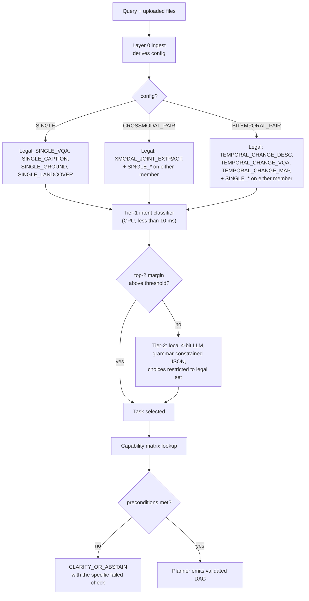

# SatQuery AI — Agentic Workflow & Orchestration

**PS 26167 · ISRO / Department of Space · SIH 2026**
Document 2 of 6 · Written 2026-08-27

> The PS makes orchestration a first-class, separately-evaluated requirement: *"the system should include an agentic layer that interprets the user query, determines the required task, selects the appropriate model or tool from a predefined registry, and executes it with permitted parameters."* It then adds the decisive qualifier: *"Internal reasoning traces are neither required nor evaluated, but the selected task, model or tool names, and key parameters used should be reported."*
>
> Read that qualifier carefully. **The evaluators grade the observable decision, not the thinking that produced it.** Everything in this document follows from that.

---

## 1. Why a constrained planner beats free-form LLM tool-calling

The instinct is to hand the query to an LLM with function-calling and let it choose. Three of the five design passes reviewed for this project do exactly that. It is the wrong call here, and the reasoning is worth being able to defend out loud to a judge.

| Dimension | Free-form LLM agent | Constrained planner over a capability matrix |
|---|---|---|
| Can emit an illegal tool for the input config | Yes — needs post-hoc guarding | **Structurally impossible** |
| Can emit an unpermitted parameter | Yes | **Structurally impossible** (Pydantic schema per tool) |
| Determinism / reproducibility | Sampling-dependent | Deterministic given (query, config) |
| Latency | 0.5–3 s per decision | < 10 ms in the common path |
| GPU cost at inference | An LLM resident in VRAM for every query | Zero in the common path |
| Offline on demo day | Needs a local LLM anyway | Works with no model loaded |
| Auditability | Trace shows what it *said* it did | Trace shows a validated plan object |
| Failure mode | Silent wrong tool, hard to reproduce | Validation error with a named cause |

The constrained planner is not a simplification that sacrifices intelligence. It produces **the same output as a well-behaved LLM agent, plus a machine-checkable guarantee**, and the guarantee is the thing being graded. The LLM is retained — but for the one job it is actually better at than a classifier, which is disambiguating genuinely ambiguous natural language. It is a **tie-breaker inside an already-legal task set**, never the authority on legality.

The metric to put on a slide: **illegal-plan rate = 0, by construction, verified against an adversarial query suite.** That is a claim no free-form agent can make.

---

## 2. The task taxonomy — closed, and derived directly from the PS

Nine tasks. Closed set. Every mandatory functional requirement in the PS maps onto at least one, and nothing exists that the PS did not ask for.

| Task ID | Description | Legal input configs | PS status |
|---|---|---|---|
| `SINGLE_VQA` | Question answering on one image | SINGLE, and either half of a pair | **Mandatory** |
| `SINGLE_CAPTION` | Scene / land-cover description | SINGLE | Mandatory (one of caption/grounding) |
| `SINGLE_GROUND` | Text-referred localisation → bbox (optional mask) | SINGLE | Mandatory (one of caption/grounding) |
| `SINGLE_LANDCOVER` | Multi-label classification + segmentation | SINGLE | Supports the adaptation mandate |
| `XMODAL_JOINT_EXTRACT` | Complementary extraction from optical+SAR | CROSSMODAL_PAIR | **Mandatory** |
| `TEMPORAL_CHANGE_DESC` | Natural-language change description | BITEMPORAL_PAIR | **Mandatory** (one of desc/VQA) |
| `TEMPORAL_CHANGE_VQA` | Question answering about change | BITEMPORAL_PAIR | **Mandatory** (one of desc/VQA) |
| `TEMPORAL_CHANGE_MAP` | Binary / semantic change mask | BITEMPORAL_PAIR | Optional bonus (PS: "where mask annotations exist") |
| `CLARIFY_OR_ABSTAIN` | Insufficient / incompatible input, or ambiguous query | any | Implied by compatibility-checking requirement |

We implement **both** change tasks and **both** of caption/grounding even though the PS only requires one of each pair. Under normalised score combination (Axiom 5 in doc `01`), covering an extra area is worth more than squeezing another two points out of one you already cover. The marginal cost is low because of weight sharing — see doc `03`.

`CLARIFY_OR_ABSTAIN` being a **first-class task in the taxonomy** rather than an error path is a deliberate signal. It means refusal is a designed behaviour with its own trace record, not a crash.

---

## 3. Routing — configuration first, then intent

The order matters and it is the cheapest correctness win in the whole system.



**Configuration gating first.** Because `config` is *derived* from the imagery rather than declared by the user (doc `01` §2.8), the legal task set is already narrowed before a single word of the query is examined. A change question asked over one image cannot route to a change tool — it routes to `CLARIFY_OR_ABSTAIN` with the message *"Change analysis requires two images of the same area at different dates; one image was supplied."*

That behaviour is worth demonstrating live. It shows the agent is reasoning about **inputs**, not just parsing text.

### 3.1 Tier 1 — the classifier that handles ~90 % of traffic

TF-IDF (word 1–2 grams + char 3–5 grams) into multinomial logistic regression, or a distilled sentence-transformer plus a linear head if you want a small accuracy bump. Under 10 ms on CPU, no GPU, deterministic, and it ships as a 2 MB pickle.

Training data is **synthetic and self-generated**, which is the point — no labelling effort:

1. Write ~60 seed templates per task, including the PS's own representative queries verbatim.
2. Expand with paraphrase rules: synonym substitution (`built-up` / `urban` / `settlement` / `construction` / `concrete`), Hinglish and Indian-English variants (`kitna badha hai`, `what all changed`, `show me where the water is`), question/imperative/elliptical forms, and typos.
3. Result: 3,000–5,000 labelled queries in roughly a day of one person's work.
4. Hold out 15 % and report the confusion matrix in the evaluation report.

Two design details that matter more than the model choice:

- **Train it as a per-config classifier.** The same sentence means different things depending on what was uploaded. Either include `config` as a feature or train three heads. This alone removes most of the hard cases.
- **Expose the confusion matrix in the UI's model registry page.** It converts "we built a classifier" into "here is how well it works," which is what an evaluator wants.

### 3.2 Tier 2 — the LLM tie-break, tightly leashed

Fires only when the top-2 margin is below threshold (target: under 10 % of queries). A local 4-bit instruction model (Qwen2.5-3B-Instruct class, or Phi-family) with **grammar-constrained decoding** so the output is guaranteed-parseable JSON, and with the `task` field's enumeration **restricted to the already-legal set for this config**.

```
System: You are a task router for a remote sensing analysis system.
Input configuration: BITEMPORAL_PAIR
Legal tasks: TEMPORAL_CHANGE_DESC | TEMPORAL_CHANGE_VQA | TEMPORAL_CHANGE_MAP | SINGLE_VQA | CLARIFY_OR_ABSTAIN
Query: "so what happened here between the two dates, and how much"

Respond with JSON only:
{"task": <one of the legal tasks>, "confidence": <0-1>, "rationale_tag": <short enum label>}
```

Note `rationale_tag` rather than free-form reasoning. The PS explicitly does not evaluate reasoning traces, and free-form text in an audit record is a liability — it is unbounded, unvalidatable and occasionally embarrassing. A short enum (`explicit_change_language`, `quantitative_request`, `ambiguous_defaulted_to_vqa`, `missing_second_image`) is auditable, diffable and testable.

The LLM **cannot** return an illegal task because it is not in the grammar. If it returns garbage anyway, the system falls back to the Tier-1 argmax and records `llm_tiebreak_failed: true`. This is defence in depth over a component you do not fully control.

### 3.3 Query decomposition for compound requests

Real queries bundle several asks: *"What changed between these two dates, show me the affected area, and how many hectares?"* That is a change description, a change map, and a quantitative computation.

Handle it by allowing the router to emit an **ordered list** of tasks, executed as a single DAG with shared intermediate artifacts. The mask computed for `TEMPORAL_CHANGE_MAP` feeds both the description and the area figure — one expensive computation, three answers. The trace shows one plan with three terminal outputs.

Keep decomposition to a maximum of three sub-tasks and require all of them to be legal for the config. Unbounded decomposition is where agentic systems become unpredictable, which is exactly what Axiom 3 tells you to avoid.

---

## 4. The capability matrix — the auditable artifact

This is the heart of the orchestration story and the single file you should put on a slide. It is version-controlled YAML, loaded and validated at startup, and its version string appears in every trace.

```yaml
version: cm-2026.11.02

XMODAL_JOINT_EXTRACT:
  description: "Extract complementary information from a co-registered optical/MSI + SAR pair"
  requires:
    config: CROSSMODAL_PAIR
    min_overlap_pct: 70
    max_coreg_shift_px: 2.0
    min_bands_optical: 3
  tools: [index_engine_v1, optsar_fusion_v1, rs_vqa_v1]
  optional_tools: [grounding_v1]
  forbidden_tools: [change_mask_v1, change_caption_v1, change_vqa_v1]
  permitted_params:
    fusion_mode:      {enum: [concat, cross_attn], default: cross_attn}
    target_gsd_m:     {type: number, min: 0.3, max: 30.0}
    classes:          {enum_subset: [built_up, water, vegetation, bare_soil], default: [built_up, water]}
    mode:             {enum: [fused_only, triad], default: triad}
    sar_threshold_method: {enum: [otsu, gmm, fixed_db], default: otsu}
  fallbacks:
    optsar_fusion_v1: index_engine_v1     # if the neural fusion tool fails, degrade to deterministic indices
  degraded_if:
    - {check: swir_available, equals: false,
       effect: "built_up uses sar_primary_texture_secondary path", confidence_penalty: 0.10}
    - {check: cloud_pct, gt: 40,
       effect: "modality weight shifts to SAR", confidence_penalty: 0.15}

TEMPORAL_CHANGE_VQA:
  description: "Answer a question about change between two co-registered dates"
  requires:
    config: BITEMPORAL_PAIR
    min_overlap_pct: 80
    max_coreg_shift_px: 2.0
    require_dates: true
  tools: [change_mask_v1, index_engine_v1, change_vqa_v1]
  optional_tools: [change_caption_v1]
  forbidden_tools: [optsar_fusion_v1]
  permitted_params:
    change_threshold:      {type: number, min: 0.1, max: 0.9, default: 0.5}
    min_object_area_px:    {type: integer, min: 0, max: 10000, default: 50}
    answer_mode:           {enum: [classify, generate, template], default: template}
    significance_pct:      {type: number, min: 0.5, max: 20.0, default: 2.0}
  fallbacks:
    change_mask_v1: index_engine_v1        # index differencing as a deterministic fallback
  degraded_if:
    - {check: modality_match, equals: false,
       effect: "cross-sensor change; radiometric comparison unreliable", confidence_penalty: 0.20}
```

Four properties make this the right abstraction:

**`requires` produces named abstention reasons for free.** A failed precondition is not a generic error — it is `"footprint_overlap 0.41 below required 0.70"`, which is exactly the message the user needs.

**`permitted_params` is the literal implementation of the PS's "permitted parameters" clause.** Each entry compiles into a Pydantic field with its bounds. A planner that tries `target_gsd_m: 0.05` raises a validation error before execution. The PS asks for permitted parameters to be reported; here they are *enforced*, and reported.

**`forbidden_tools` is redundant defensively but valuable rhetorically.** It makes the constraint explicit in a file a reviewer can read in ten seconds.

**`degraded_if` encodes Axiom 2 declaratively.** The SWIR-absence penalty is not buried in code; it is a visible rule with a stated effect and a stated confidence cost. When the demo runs on a 4-band Cartosat product and the trace says `"built_up uses sar_primary_texture_secondary path"`, that came from this file.

Ship a **`satquery matrix --validate`** command that checks every task references only registered tools, every parameter has bounds, and every fallback exists. Run it in CI. A broken matrix should fail the build, not the demo.

---

## 5. The plan object and its validation

```python
class PlanStep(BaseModel):
    step_id: str
    tool: str                        # must exist in the registry
    tool_version: str                # pinned, appears in the trace
    inputs: list[str]                # artifact keys or upstream step_ids
    params: dict                     # validated against the tool's permitted_params schema
    rationale_tag: str               # short enum, NOT free-form prose
    on_failure: Literal["abort","fallback","continue_degraded"]

class Plan(BaseModel):
    run_id: str
    tasks: list[TaskID]              # 1-3, all legal for this config
    steps: list[PlanStep]            # topologically sorted, validated acyclic
    fallbacks: dict[str, str]         # step_id -> alternate tool
    matrix_version: str
    estimated_vram_mb: int
    estimated_runtime_ms: int
```

Validation runs in five passes before anything executes:

1. **Task legality** — every task in `tasks` is legal for the derived config.
2. **Tool legality** — every `tool` appears in the task's `tools` or `optional_tools`, and in none of its `forbidden_tools`.
3. **Parameter legality** — `params` validates against that tool's `permitted_params` model; out-of-range values are rejected with the bound that was violated.
4. **DAG integrity** — topologically sortable, no cycles, every `inputs` reference resolves to an existing artifact key or an upstream `step_id`.
5. **Resource feasibility** — `estimated_vram_mb` fits the profile's budget after accounting for LRU eviction; if not, the plan is rewritten to serialise the heavy steps.

A plan that fails any pass never runs. The failure is recorded in the trace with the pass that rejected it. **That is the illegal-plan-rate-zero guarantee, and it is five straightforward functions, not research.**

### 5.1 Planner construction: templates, not generation

For each task the matrix already names the tools and their dependency order, so plan construction is largely **template instantiation with parameter binding**:

```python
def build_plan(task: TaskID, manifest: InputManifest, query: str) -> Plan:
    spec = MATRIX[task]
    steps = []
    for tool_name in spec.tools:                        # ordered in the matrix
        params = bind_params(tool_name, spec.permitted_params, manifest, query)
        steps.append(PlanStep(
            step_id=f"s{len(steps)+1}", tool=tool_name,
            tool_version=REGISTRY[tool_name].version,
            inputs=resolve_inputs(tool_name, steps, manifest),
            params=params, rationale_tag=tag_for(tool_name, task),
            on_failure="fallback" if tool_name in spec.fallbacks else "abort"))
    steps += optional_steps(spec, manifest, query)      # e.g. grounding when the query names an object
    return validate(Plan(...))
```

`bind_params` is where query-conditioned intelligence lives: extracting class names the user mentioned (`classes: [water]` if they only asked about water), setting `target_gsd_m` from the finer input's GSD, choosing `answer_mode: template` when the query is quantitative, switching `sar_threshold_method` when calibration metadata is absent. Every binding it produces is still validated against the schema — the intelligence is bounded.

This is not "less agentic." The system still interprets the query, still selects tools, still sets parameters, still adapts to inputs and failures. It just does so through a mechanism whose output can be proven legal.

---

## 6. The executor

```python
class Executor:
    def run(self, plan: Plan, manifest: InputManifest, sink: TraceSink) -> RunResult:
        ctx = ExecutionContext(manifest)
        for step in plan.steps:                          # already topologically sorted
            sink.emit("step_start", step)
            tool = self.registry.get(step.tool, step.tool_version)
            self.vram.ensure(tool.vram_mb)               # LRU-evict until it fits
            checks = tool.preflight(manifest)
            if any(c.status == "FAIL" for c in checks):
                result = self.handle_failure(step, checks, ctx, plan)
            else:
                try:
                    result = tool.run(ctx.resolve(step.inputs), step.params)
                except Exception as e:
                    result = self.handle_failure(step, e, ctx, plan)
            ctx.record(step.step_id, result)
            sink.emit("step_done", step, result)
        return ctx.finalize()
```

### 6.1 VRAM management and LoRA hot-swapping

On a 16 GB T4 you cannot hold nine models. The manager declares a per-tool VRAM budget in `tools.yaml`, keeps an LRU cache of loaded models, and evicts before loading.

The important optimisation: `rs_vqa_v1` and `caption_v1` share a backbone and differ only by LoRA adapter. Similarly `landcover_v1` and `optsar_fusion_v1` share an encoder. So the manager loads the **base once** and swaps adapters — a ~100 ms operation against several seconds for a full model load. This makes multi-tool plans genuinely fast rather than nominally supported.

```yaml
# tools.yaml (excerpt)
rs_vqa_v1:
  base: qwen2_5_vl_3b_4bit
  adapter: adapters/rs_vqa_lora_v6
  vram_mb: 4200
  weights_sha256: "..."
caption_v1:
  base: qwen2_5_vl_3b_4bit          # SAME base -> adapter swap only
  adapter: adapters/caption_lora_v4
  vram_mb: 0                        # marginal cost over the shared base
  weights_sha256: "..."
```

### 6.2 Failure handling — three declared policies

`abort` records the failure, emits `CLARIFY_OR_ABSTAIN`, and explains what broke. `fallback` substitutes the matrix-declared alternate — critically, `index_engine_v1` is the fallback for both the fusion and the change-mask tools, so **a neural failure degrades to a deterministic answer rather than to no answer**. `continue_degraded` proceeds with the step's contribution missing and applies the confidence penalty.

Every one of these paths writes to the trace. A run that degraded gracefully is a *demonstration of robustness*, not something to hide, and it should be shown deliberately in the demo.

### 6.3 Batching in eval mode

In `--eval-mode` the executor groups items by plan shape and calls `tool.run_batch` instead of `tool.run`, because identical plans over hundreds of items is the common case in benchmark evaluation. This is why `run_batch` is in the tool protocol from week 1 rather than bolted on in week 13.

---

## 7. Worked traces for the PS's own representative queries

The PS lists five representative queries. Each must work end to end, and each should appear in the demo. These are the acceptance tests.

### Q1 — *"How many aircraft are visible in this image?"*
`SINGLE` → Tier-1 → `SINGLE_VQA` (counting sub-type detected) → plan: `grounding_v1` (detect "aircraft") then a **deterministic count over the returned boxes** after NMS, then a template answer.

The insight: never let a VLM count. VLM counting is notoriously unreliable above about five objects. Detect, then count the detections arithmetically. Confidence is derived from mean detection score and box-count stability across the tiling overlap. Output includes bboxes as GeoJSON so the count is *visibly* verifiable — the judge can see the eight boxes that produced "8".

### Q2 — *"Describe the land-cover characteristics of this scene."*
`SINGLE` → `SINGLE_CAPTION` → plan: `index_engine_v1` (NDVI/NDWI/texture statistics + class fractions) → `landcover_v1` (multi-label + segmentation) → `caption_v1` (narrative from structured payloads) → entailment gate.

The narrative is generated from the structured land-cover fractions, so it says *"approximately 34 % vegetation concentrated in the north-west, 12 % water"* with the numbers coming from the mask rather than from the language model's imagination.

### Q3 — *"Use the optical and SAR images together to identify built-up and water-covered regions."*
`CROSSMODAL_PAIR` → `XMODAL_JOINT_EXTRACT` → plan: `index_engine_v1` (NDWI + GLCM texture + adaptive σ⁰ threshold) → `optsar_fusion_v1` in `triad` mode (optical-only, SAR-only, fused) → `rs_vqa_v1` for the narrative → verifier + complementarity score.

This is the query where Axiom 2 bites: NDBI is unavailable on 4-band Cartosat MX, so built-up runs the SAR-primary path and the trace says so. Handled correctly, this is the strongest single moment in the demo, because it shows the system knows the physics of its own inputs.

### Q4 — *"Describe the changes between these two images."*
`BITEMPORAL_PAIR` → `TEMPORAL_CHANGE_DESC` → plan: `index_engine_v1` (per-date indices + difference rasters) → `change_mask_v1` → `change_caption_v1` (mask-conditioned) → entailment gate → evidence pack with the mask as GeoTIFF.

Mask-conditioning the caption is what stops it producing generic change language. The caption is written from a payload that already says *"built-up increased by 4.7 ha in the south-east quadrant; vegetation decreased by 3.1 ha in the same region."*

### Q5 — *"Has the built-up area increased, decreased, or remained unchanged?"*
`BITEMPORAL_PAIR` → `TEMPORAL_CHANGE_VQA` → plan: `index_engine_v1` → `change_mask_v1` with `classes: [built_up]` → **deterministic template answer** (`answer_mode: template`).

```python
delta_ha = (area_t2 - area_t1) / 10_000
if abs(delta_ha) / max(area_t1/10_000, 1e-6) < significance_pct/100:
    answer = "remained unchanged"
else:
    answer = "increased" if delta_ha > 0 else "decreased"
```

Three-way classification over a computed area difference with an explicit significance threshold. Near-perfectly reliable, fully explainable, and it reports the actual hectares alongside the categorical answer. A generative model asked this question will occasionally get the direction wrong; a subtraction will not.

---

## 8. Handling the hard routing cases

The cases below are where a naive router fails, and each is worth a line in the report because it shows the design was stress-tested rather than demoed.

**Wrong-config question.** Change question, one image → `CLARIFY_OR_ABSTAIN`: *"Change analysis needs two dated images of the same area; one was supplied. Upload the second date."* Never fabricate a comparison.

**Cross-modal pair, single-image question.** *"How many buildings are in the optical image?"* over a CROSSMODAL_PAIR → route to `SINGLE_VQA` on the named member. The router must resolve which image the query means from modality words (`optical`, `SAR`, `radar`) and default to the optical member for object questions, logging the choice.

**Ambiguous quantity.** *"How much has it changed?"* — "how much" implies quantity, which implies a mask, which implies `TEMPORAL_CHANGE_MAP` feeding a quantitative template. Route to the compound plan rather than to a vague description.

**Heavy cloud on the optical member.** Cloud fraction is a routing signal, not just a warning. Above ~40 % it triggers the `degraded_if` rule: modality weight shifts to SAR, the confidence penalty applies, and the answer states *"optical member 63 % cloud-obscured; analysis is SAR-weighted."* This is real operational behaviour and almost nobody else will implement it.

**Out-of-scope query.** *"What is the weather forecast here?"* → `CLARIFY_OR_ABSTAIN` with a scope statement. Include at least one of these in the adversarial suite; a system that refuses cleanly out of scope is more trustworthy than one that improvises.

**Same-date "bi-temporal" pair.** Dates parse to the same day → `WARN`, and the change tools are still permitted but the confidence prior drops sharply with the message *"identical acquisition dates; any detected change is likely processing artefact."*

---

## 9. Testing the orchestration layer

Orchestration correctness is testable without any GPU, which means it can be fully verified in week 3 while models are still training. Do not waste that.

**Golden trace tests.** ~30 curated cases spanning all nine tasks, all three configs, and every hard case in §8. Each stores an expected trace JSON with the models stubbed. Any planner change that alters routing shows up as a diff in review. This is the cheapest regression insurance available and it doubles as documentation.

**Adversarial routing suite.** ~200 queries designed to break the router: wrong config, out of scope, contradictory (*"describe the change in this single image"*), multi-task, Hinglish, misspelled, empty, extremely long. Assertions: zero illegal plans, zero unhandled exceptions, every rejection carries a named reason. Report the pass rate.

**Property-based tests** with Hypothesis over the parameter binder: for any generated `(task, manifest, query)`, the produced plan validates. This catches binder bugs that hand-written tests miss.

**Matrix validation in CI** — `satquery matrix --validate` as a build gate.

---

## 10. What the evaluator sees

Everything in this document surfaces as three concrete artifacts, and it is worth being explicit about the mapping because a well-built layer that is invisible scores nothing.

1. **The live trace panel** — steps appearing over SSE with tool names, versions, permitted parameters, latencies and per-step confidence. This is the PS's "auditable execution summary" rendered as a running feed.
2. **`configs/capability_matrix.yaml`** — a human-readable file that *is* the constraint system. Open it on screen during the pitch. It answers "how do you know the agent only uses permitted parameters?" in one scroll.
3. **The rejection and the abstention** — deliberately open the demo with an incompatible upload being rejected for a stated reason, and close it with a low-confidence case abstaining and naming what would resolve it. Bracketing the demo with the system's limits is far more persuasive than a run of five successes, and it is the behaviour an operational agency actually cares about.

---

*Continues in `03-Models-and-Datasets.md`.*
